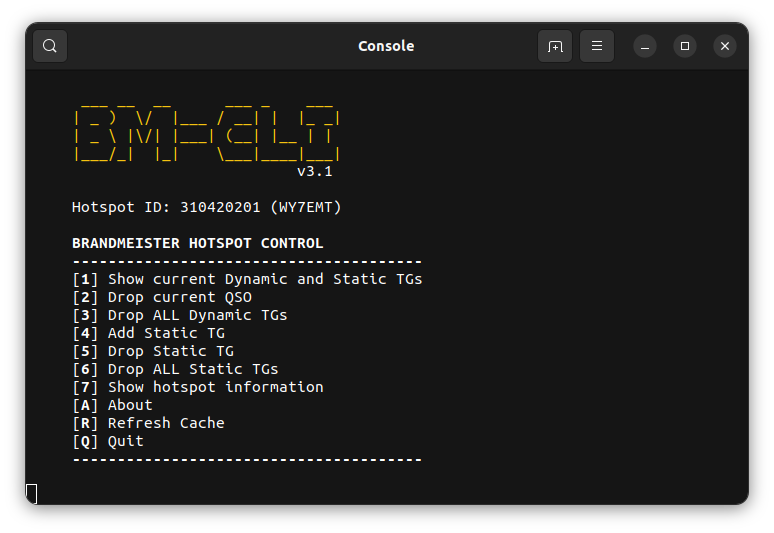

<center>

# bm-hotspot-cli

## Manage Talkgroups on your Hotspot via Brandmeister-API



[Original code by cascha42](https://github.com/cascha42/bm-hotspot-cli)

</center>

## Modifications to original code
- Moved important variable settings out of the main program
and into a config file.
- Updated code base to work with the new Brandmeister API version (v2).
- Fixed the jq parsing errors.
- Minor usability and UI changes.
- Added caching of TS, TG and hotspot information.  Any changes made to the
timeslots and talkgroups will trigger a refresh of the information, otherwise
the program uses the cache file.
- Added option to force cache refresh.
- Added an option to show basic hotspot information.
- Added a double confirmation to the "Drop ALL Static TGs" menu option.

## *POSSBILE* Updates
[ ] Move to dialog or zenity  
[ ] Additional menu options (there's a LOT of things you can do with the API)  
[ ] Merge current code with original code base. 

## Installation
```
git clone https://github.com/azfirefighter/bm-hotspot-cli.git && cd bm-hotspot-cli
chmod +x bm-hotspot-cli.sh
```
## Configuration
```
1. Add your BM API key to bm-hotspot-cli.conf between the single quotes at APIKEY=''
2. Add your BM hotspot ID to bm-hotspot-cli.conf betwen the single quotes at HOTSPOT=''
```
 
 
---
## Any questions? Need help? Suggestions?
Feel free to contact me.  My callsign is **WY7EMT**.
The email address is
**CALLSIGN** [at] *lltodd.family* or **CALLSIGN** [at] *winlink.org*.  
Of course, remove the spaces and replace [at] with the @ sign.